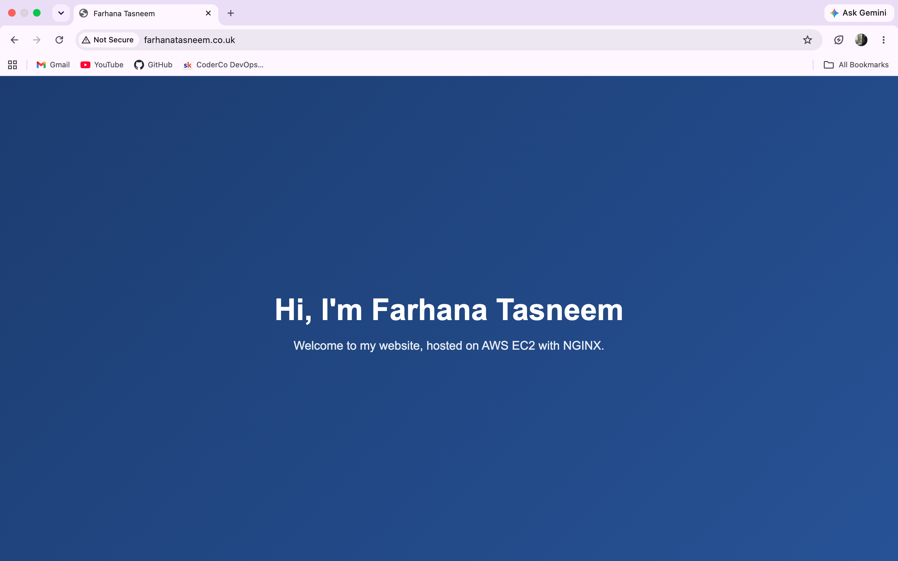

# NGINX-EC2-Project-

-> This is the step by step process I took to launch an NGINX server on Amazon EC2, after I purchased a domain name from Cloudflare

-> By the end of these steps, the site lived in my custom domain - powered by AWS and NGINX 

### Step 1 - Buy the domain on Cloudflare 
1. Go to https://www.cloudflare.com
2. Search the domain name you would like e.g. farhanatasneem.co.uk and purchase it
3. After the purchase is done, Cloudflare automatically manages DNS, which helps in later steps 

### Step 2 - Launch an EC2 instance on AWS 

1. Search EC2 in the search bar and click on Launch Instance 

Settings:
- Name: nginx-server
- AMI: Amazon Linux 2023 
- Instance type: t3.micro 
- Key pair: assuming you haven't got a existing key create a new one and keep it safe. If you do just click that .pem key 

Security group settings:
1. SSH (Port 22) - Source: 0.0.0.0/0
2. HTTP (Port 80) - Source 0.0.0.0/0
3. HTTPS (Port 443) - Source 0.0.0.0/0
4. After these settings, you can launch instance 
5. A public IPv4 address will be available, copy this and save it. 

### Step 3 - Connect to the EC2 Instance via SSH 
- Replace the placeholders below with your key path and EC2 public IP:
- ssh -i ~/path/to/key.pem ec2-user@<EC2_PUBLIC_IP>

### Step 4 - Install and start NGINX on EC2 

Run the following commands 
1. sudo yum update –y
2. sudo yum install -y nginx
3. sudo systemctl start nginx
4. sudo systemctl enable nginx
5. sudo systemctl status nginx -> In green you will see "Active running"

-> Test this by opening http://<YOUR_EC2_PUBLIC_IP> in your browser and you should see the NGINX welcome page 

### Step 5 - Point your Domain to the EC2 IP (Cloudflare)
 
 1. In Cloudflare, you will see DNS on the side bar. Click on it and add record 
 2. In the options box:
 - Type: A
 - Name: nginx.yourdomain.co.uk
 - IPv4 Address: <EC2_PUBLIC_IP>
- TTL: Auto 
- Proxy Status: DNS only (grey cloud) for intial testing 

-> And then save 

### Step 6 - See if your DNS is live 

- From your local terminal 
- - nslookup your domain

OR 

- - dig +short your.domain 

-> You will see your public IP address that's written on your EC2 instance

-> If you visit directly with http://(your domain) - the default NGINX page will appear 

### Extra to customise the page 

- Go to the EC2 instance and connect. A black terminal will appear
- Enter the follow commands:
- cd /usr/share/nginx/html
- sudo cp index.html index.html.bak

You can edit the page:
- sudo nano index.html 
- Delete the default content and paste in your own HTML code 
- Save it and test 
- sudo systemctl reload nginx 
- Reload and test and the custom page should be visible 

